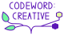
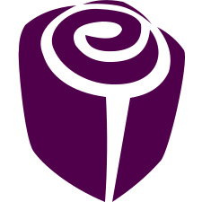
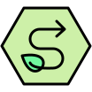

<h1>&nbsp; Rose Newell</h1>

Full-stack sustainable web developer, copywriter, content designer, and technical SEO consultant based in Berlin. 
Native English, fluent German.

<a href="https://rosenewell.co.uk"> rosenewell.co.uk</a>&nbsp;&nbsp;&nbsp;
<a href="https://codewordcreative.com"> codeword: creative</a>&nbsp;&nbsp;&nbsp;
<a href="https://englishroseberlin.com"> English Rose Berlin</a>&nbsp;&nbsp;&nbsp;
<a href="https://sustyicons.com"> Susty Icons</a>&nbsp;&nbsp;&nbsp;
<a href="https://chromamo.de"> ChromaMo.de</a>

&nbsp;
&nbsp;
&nbsp;
&nbsp;

 

## About

I build fast, sustainable websites, with completely hand-coded HTML, CSS, JS, and SVGs. Or I build astoundingly fast and sustainable WordPress sites complete with my own custom plugins for optimal function and efficiency. I also write native English copy to drive clicks and convert. I optimise all code, copy, and assets for users and search engines. Put simply, I design content that works, building brands and strategy that translate into success. Oh, and I translate from German, too.

 

## What I do

- Sustainable web consultant
- Full-stack web developer
- Technical and on-page SEO consultant
- Conversion copywriter
- Content designer
- Brand strategist
- Technical marketing specialist
- Sustainable icon designer
- Automation and tooling tinkerer
- English-native translator, fluent in German
- Web standards nerd
- W3C Invited Expert, Editor, and UX Co-Lead (until recognition as Editor): Sustainable Web Guidelines

 

## Where I can help

<table>
<tr>
<td width="50%" valign="top">

<strong>🛠️ Web and Digital Strategy</strong> 
Ultra-efficient WordPress or hand-coded static builds. Better performance and UX, lower hosting costs, and GDPR-compliance and accessibility built in by design. Multilingual tools available too, plus full performance and sustainability audits for existing sites.

</td>
<td width="50%" valign="top">

<strong>🔍 Technical SEO and Analytics</strong> 
On-page, technical, and international SEO for visibility and search performance, even in the AI era. Thorough audits covering performance and user behaviour, revealing clear and actionable next steps (and quick wins).

</td>
</tr>
</table>

<table>
<tr>
<td width="50%" valign="top">

<strong>✍️ Content and Brand Strategy</strong> 
Copy that converts and a strategy that sticks, backed by intercultural marketing insights, advanced UX knowledge, and a knack for translating technical subjects into language the world can understand.

</td>
<td width="50%" valign="top">

<strong>🌱 Sustainable Digital Systems</strong> 
Migrate off big tech to secure, sustainable, EU/EEA-based infrastructure. Private clouds, email, backups, monitoring, APIs, and automated workflows. I focus on FOSS and privacy-first, sustainable implementations with Linux.

</td>
</tr>
</table>

 

## How I work

#### Consulting and audits
SEO, sustainability, performance, and UX reviews with two-hour walkthroughs and actionable recommendations.

#### End-to-end projects
Full-scope projects spanning strategy, content, UX, and technical implementation.

#### Full-stack freelance
Team integration to cover any gaps: web dev, copywriting, UX, brand strategy, tech, or bilingual expertise.

 

Want the full picture, or want to get in touch? Head to <a href="https://rosenewell.co.uk"><strong>rosenewell.co.uk</strong></a>.

Based in Berlin, Germany (GMT+1/CET)

&nbsp;
&nbsp;
&nbsp;
&nbsp;

